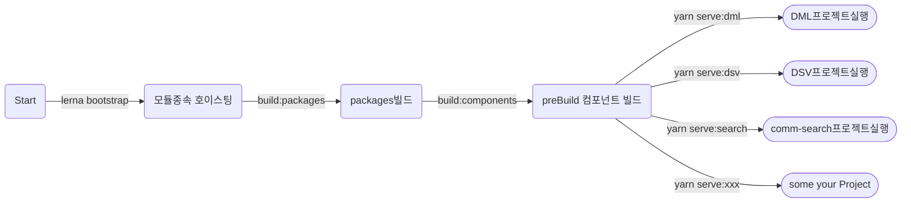

## use
Name         | Version    |
:------      | :------    |
`Vue`        | 3.0.0      | 
`Node`       | 16.14.0    |  
`lerna`      | 4.0.0      |  
`yarn berry` | 3.2.0      |  
`tsc`        | 4.5.4      |
 
 ## Mono프로젝트 구조.
~~~
--applications
    ㄴ dml : 몰 프로젝트
    ㄴ dsv : 서비스 프로젝트

--components
    ㄴ comm-components : 공통 컴포넌트
    ㄴ comm-search : 통합검색 컴포넌트

--packages
    ㄴ lru-cache : LruCache 패키지
    ㄴ mock-service : MockService 패키지
    ㄴ type-utils : 유틸 패키지(Pre Build)
~~~
## 프로젝트 실행과정


## Mono도입 의도
 1. 모듈별 격리 : 각 모듈들은 IDE를 통해 독립 실행 & 테스트 가능
 2. 재사용 : 공통으로 사용하는 컴포넌트, 화면, 모듈화
## Repo Rules
  - applications/* 모듈간 의존하지 않아야 한다.
  - components/* 모듈간 의존하지 않아야 한다.
  - packages/* 모듈간 의존하지 않아야 한다.

  - packages/*는 다른 workspace에서도 자유롭게 참조 가능.
  - components/*는 applications workspace에서만 참조.

## 모듈타입

 - PreBuild : 모듈에서 사전 빌드되어 바닐라 js 형태로 빌드. 프레임워크에 종속적이지 않음.
 - Include : 부모 프로젝트에 코드가 추가 되어 부모에서 빌드됨. 프레임워크에 종속적일 수 있음.
```
ex) components/quassar/q-btn을 dml에서 사용 시 빌드 불가. dml은 quassar 프레임워크를 사용하지 않으므로 quassar 컴파일 불가. 
```


## installs
```sh
- nvm use 16.14.0
# - npm install --global yarn@1.22.17
- npm install --global yarn
- yarn set version berry
- npm install -g lerna@4.0.0
- npm install @vue/cli -g (@vue/cli 4.5.15 - Optional
```

## Execute
```sh
- yarn install
- yarn build:components
- yarn serve:dml
```

## workspace Script
- cd {yourPath}/mono
- "build:dml": "yarn workspace dml build",
- "serve:dml": "yarn workspace dml serve",
- "build:search": "yarn workspace @god/comm-search build",
- "serve:search": "yarn workspace @god/comm-search serve"


## mono Repo 중 dml프로젝트 Docker 이미지 생성과정
```mermaid
graph TB
A(Docker Host: ../mono) --docker build -f Dockerfile-dml-develop --> B((Docker Build Start))
B --lerna bootstrap--> C(모듈종속 호이스팅) --lerna run build:packages--> ALL(packages/* Build Complete)
ALL --yarn build:dml-->D2(applications/dml/dist/*)
D2 --nginx Copy-->E(Docker Image)
E --docker run --name 'mono-dml' -d -p 21101:80 mono-dml-->FI(컨테이너 적재)
```


## docker 명령어
 - 실행중인 컨테이너 확인 : docker ps
 - 빌드된 이미지 확인 : docker images
 - 컨테이너 삭제 : docker rm { 컨테이너명 }
 - 이미지 삭제 : docker rmi { dockerid }
 - 도커 이미지 빌드 : docker build -f Dockerfile-dml-develop  -t mono-dml .
 - 도커 실행 : docker run --name "mono-dml" -d -p 21101:80 mono-dml

## husky 
 ```sh
 // installs
 yarn add husky -W -D

 // enableHusky
 npx husky install 

// package.json
 "scripts": {
    "prepare": "husky install"
    //"postinstall": "husky install && cp -a .husky/. .git/hooks/" // if use GitKraken
  }
 ```
 ## Husky Rules
- 공통 개발자 외에 공통 workspace 커밋을 제한.(사람에 실수 까지도 시스템이 제한)
- 필요한 경우 일반 개발자도 쉽게 커밋제한을 해제 할 수 있어야 한다. 
```
// {yourPath}/mono/.husky/pre-commit
readonly COMM_OWNER_HOST_NAMES=("godBeomPC") // 기존
>> whoami
commDeveloperPC
readonly COMM_OWNER_HOST_NAMES=("godBeomPC", "commDeveloperPC") // 추가
```

## lerna Scripts
lerna add vue-cookies --scope=@app/dsv;  


## refs
- proxy : https://blog.naver.com/PostView.naver?blogId=minhyupp&logNo=222114121784&parentCategoryNo=&categoryNo=47&viewDate=&isShowPopularPosts=true&from=search
- lerna with yarn 정리 : https://awesomezero.com/development/lerna_and_yarn_workspace/
- 플러그인 : https://velog.io/@skyepodium/%EB%82%B4-%EC%B5%9C%EC%95%A0-VS-Code-%ED%99%95%EC%9E%A5-%ED%94%84%EB%A1%9C%EA%B7%B8%EB%9E%A8
- tsconfig 이해1 : https://velog.io/@sooran/tsconfig.json-%EC%A0%9C%EB%8C%80%EB%A1%9C-%EC%95%8C%EA%B3%A0-%EC%82%AC%EC%9A%A9%ED%95%98%EA%B8%B0
- tsconfig 옵션 설명 : https://typescript-kr.github.io/pages/tsconfig.json.html
- 순수 컴포넌트 모듈 관련 : https://github.com/pixari/component-library-monorepo
- ts Lerna : https://github.com/dz333333/vue-ts-ui
- docker: https://www.daleseo.com/docker-run/
- TypeScript모듈 컴파일 :  ex) cd {yourPath}/mono/packages/type-utils && tsc 
- husky : https://library.gabia.com/contents/8492/
## CodeGen
1. wget https://petstore.swagger.io/v2/swagger.json
2. wget https://repo1.maven.org/maven2/org/openapitools/openapi-generator-cli/5.0.0-beta/openapi-generator-cli-5.0.0-beta.jar -O openapi-generator-cli.jar
3. java -jar openapi-generator-cli.jar generate  -i swagger.json -o api-client -g typescript-axios 


## 더 
- zero-install 적용
- yarn2 berry Plugin적용
- storybook적용
- husky Workspace Commit제한 -> 완료(2.28) comm-workspaces Owners(COMM_OWNER_HOST_NAMES)가 아닌자가 커밋을 시도 할 경우 Commit FailBack 
- esLint 공통화 (Typescript, vue)
- DockerFile Build 속도 개선(lerna/yarn docker Image, 선택적 copy )
- components/* 상대경로 적용
- packages/*, components/* save To build ->완료  (2.22)
- packages/* index.ts 전환 -> 완료 (2.15)
- Git Publish 연동 Shell -> 완료 (2.23)


## 설계자 메모 이해x
- 기존 진행중이던 프로젝트 합류가 쉬워야 한다.
- include된 모듈은 완전히 격리되는지 확인 -> (preBuild완전격리 O, include X : 부모모듈 컴파일 종속)
- export된 components/* single 컴포넌트에서 여러 컴포넌트 조합하여 applications/에 추가 
- preBuild components/* <-> include Diff 확인

