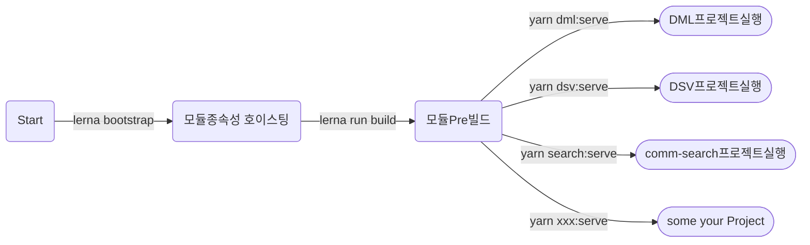

## use
Name         | Version    |
:------      | :------    |
`Vue`        | 3.0.0      | 
`Node`       | 16.14.0    |  
`lerna`      | 4.0.0      |  
`yarn`       | 1.22.17    |  
`tsc`        | 4.5.4      |  

## Mono도입 의도
 1. 모듈별 격리 : 각 모듈들은 IDE를 통해 독립 실행 & 테스트 가능
 2. 재사용 : 공통으로 사용하는 컴포넌트, 화면, 모듈화

 
 ## Mono프로젝트 구조.
~~~
--applications
    ㄴ dml : 몰 프로젝트
    ㄴ dsv : 서비스 프로젝트

--components
    ㄴ comm-components : 공통 컴포넌트
    ㄴ comm-search : 통합검색 컴포넌트

--packages
    ㄴ mock-service : MockService 패키지
    ㄴ type-utils : 유틸 패키지(Pre Build)
~~~

## 프로젝트 실행과정

## Repo Rules
  - applications/* 모듈간 의존하지 않아야 한다.
  - components/* 모듈간 의존하지 않아야 한다.
  - packages/* 모듈간 의존하지 않아야 한다.

  - packages/*는 다른 workspace에서도 자유롭게 참조 가능.
  - components/*는 applications workspace에서만 참조.

## plugins
- ESLint
- Vetur

## installs
- nvm use 16.14.0
- npm install --global yarn (1.22.17)
- npm install -g lerna(4.0.0)    
- npm install @vue/cli -g (@vue/cli 4.5.15 - Optional)
- lerna bootstrap
- lerna run build

## workspace Script
- cd {yourPath}/mono 
- "dml:build": "yarn workspace dml build",
- "dml:serve": "yarn workspace dml serve",
- "search:build": "yarn workspace @god/comm-search build",
- "search:serve": "yarn workspace @god/comm-search serve"

## TypeScript모듈 컴파일 
- cd {yourPath}/mono/packages/type-utils
- tsc 

## refs
- lerna with yarn 정리 : https://awesomezero.com/development/lerna_and_yarn_workspace/
- 플러그인 : https://velog.io/@skyepodium/%EB%82%B4-%EC%B5%9C%EC%95%A0-VS-Code-%ED%99%95%EC%9E%A5-%ED%94%84%EB%A1%9C%EA%B7%B8%EB%9E%A8
- tsconfig 이해1 : https://velog.io/@sooran/tsconfig.json-%EC%A0%9C%EB%8C%80%EB%A1%9C-%EC%95%8C%EA%B3%A0-%EC%82%AC%EC%9A%A9%ED%95%98%EA%B8%B0
- tsconfig 옵션 설명 : https://typescript-kr.github.io/pages/tsconfig.json.html
- 순수 컴포넌트 모듈 관련 : https://github.com/pixari/component-library-monorepo
- ts Lerna : https://github.com/dz333333/vue-ts-ui

## CodeGen
1. wget https://petstore.swagger.io/v2/swagger.json
2. wget https://repo1.maven.org/maven2/org/openapitools/openapi-generator-cli/5.0.0-beta/openapi-generator-cli-5.0.0-beta.jar -O openapi-generator-cli.jar
3. java -jar openapi-generator-cli.jar generate  -i swagger.json -o api-client -g typescript-axios 

## husky 
 https://library.gabia.com/contents/8492/

## 더 
- esLint 공통화 (Typescript, vue)
- components/* 상대경로 적용
- packages/*, components/* save To build ->완료  (2.22)
- packages/* index.ts 전환 -> 완료 (2.15)
- Git Publish 연동 Shell -> 완료 (2.23)

